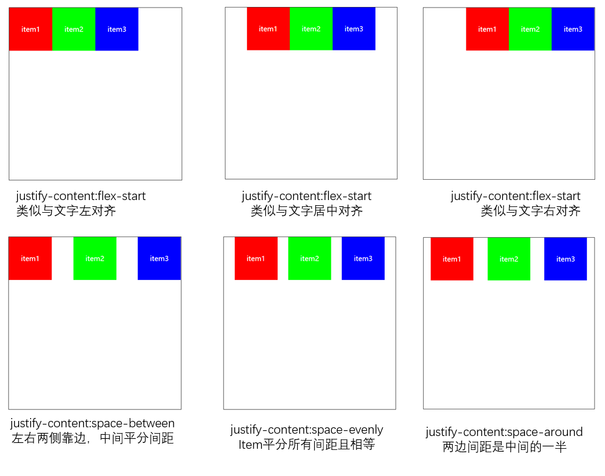

# flex布局(二) : 位置与排列方式

### 1. flex-direction
 改变主轴方向为：水平row(默认) 或者 垂直column
并且设置item元素的排序方式start->end(默认) 或者 end->start
- row
- row-reverse
- column
- column-reverse

``` html
<style>
.container{
    /* 改变主轴方向 */
    display: flex;
    flex-direction: row;
    flex-direction: row-reverse;
    flex-direction: column;
    flex-direction: column-reverse;
}
</style>

```


### 2. justify-content
改变item元素在主轴main(水平)上的对齐方式
- flex-start
- flex-center
- flex-end
- space-between
- space-evently
- space-around

``` html
<style>
.container{
    display: flex;
    /* 改变item在主轴上的对齐方式 */
    justify-content: flex-start;
    justify-content: flex-end;
    justify-content: center;
    justify-content: space-between;
    justify-content: space-evenly;
    justify-content: space-around;
}
</style>

```




### 3. align-items
改变item元素在在交叉轴cross(垂直)上的对齐方式
- stretch
- baseline
- flex-start
- center
- flex-end

``` html
<style>
.container{
    display: flex;
    flex-direction: row;
    justify-content: flex-start;

    /* 改变item在交叉轴(垂直)cross的对齐方式 */
    align-items: stretch;
    align-items: flex-start;
    align-items: center;
    align-items: flex-end;
    align-items: baseline;
    
}
.item{
    width: 100px;
    /* 不设置item高度 */
    /* height: 100px; */
    color: #fff;
    text-align: center;
}
</style>


```


