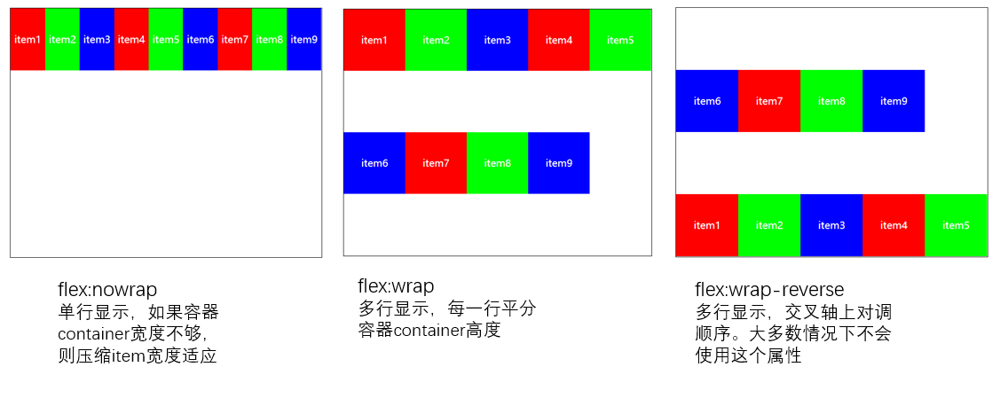
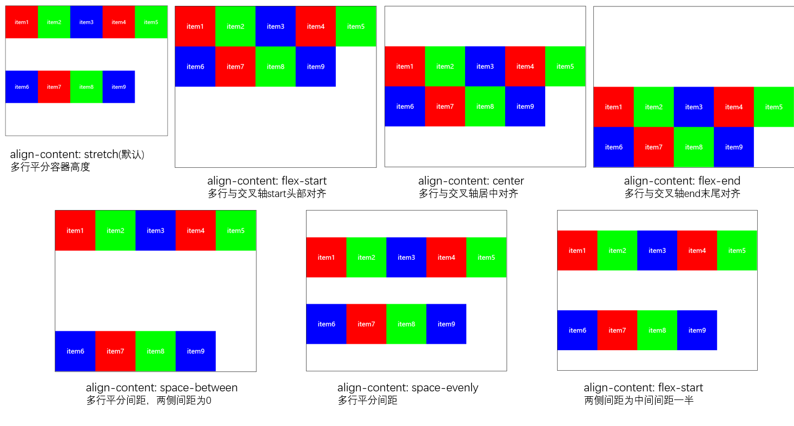

# flex布局(三) : 多行显示
### 4. flex-wrap
控制item的多行显示
- nowrap(默认) ：单行显示，如果容器container宽度不够，则压缩item宽度适应
- wrap ：多行显示，每一行平分容器container高度
- wrap-reverse ：多行显示，交叉轴上对调顺序。大多数情况下不会使用这个属性

``` html
<style>
.container{
    width: 500px;
    height: 400px;
    border: 1px solid #000;
    display: flex;
    flex-direction: row;
    justify-content: flex-start;
    align-items: flex-start;
}
.item{
    width: 100px;
    height: 100px;
    color: #fff;
    text-align: center;
    line-height: 100px;
}
.container{
    /* 设置多行显示 */
    flex-wrap: nowrap;
    flex-wrap: wrap;
    flex-wrap: wrap-reverse;
}

</style>

<body>
    <div class="container">
        <div class="item" style="background: #f00;">item1</div>
        <div class="item" style="background: #0f0;">item2</div>
        <div class="item" style="background: #00f;">item3</div>
        <div class="item" style="background: #f00;">item4</div>
        <div class="item" style="background: #0f0;">item5</div>
        <div class="item" style="background: #00f;">item6</div>
        <div class="item" style="background: #f00;">item7</div>
        <div class="item" style="background: #0f0;">item8</div>
        <div class="item" style="background: #00f;">item9</div>
    </div>
</body>
```



### 5. flex-flow
flex-direction和flex-wrap的组合缩写属性
- flex : flex-direction || flex-wrap

通常情况设置为`flex-flow:row wrap`


### 6. align-content
控制行与行之间的对齐方式，只用在多行显示。需要设置`flex-wrap: wrap`
- stretch(默认)
- flex-start
- flex-center
- flex-end
- space-between
- space-evently
- space-around

``` html
<style>
.container{
    width: 500px;
    height: 400px;
    border: 1px solid #000;

    /* flex布局的排列方式 */
    display: flex;
    flex-direction: row;
    justify-content: flex-start;
    align-items: flex-start;
}
.item{
    width: 100px;
    height: 100px;
    color: #fff;
    text-align: center;
    line-height: 100px;
}
.container{
    /* 设置多行显示 */
    flex-wrap: wrap;
    align-content: stretch;
    align-content: flex-start;
    align-content: center;
    align-content: flex-end;
    align-content: space-between;
    align-content: space-evenly;
    align-content: space-around;
    
}

</style>

<body>
    <div class="container">
        <div class="item" style="background: #f00;">item1</div>
        <div class="item" style="background: #0f0;">item2</div>
        <div class="item" style="background: #00f;">item3</div>
        <div class="item" style="background: #f00;">item4</div>
        <div class="item" style="background: #0f0;">item5</div>
        <div class="item" style="background: #00f;">item6</div>
        <div class="item" style="background: #f00;">item7</div>
        <div class="item" style="background: #0f0;">item8</div>
        <div class="item" style="background: #00f;">item9</div>
       
    </div>
</body>

```



 