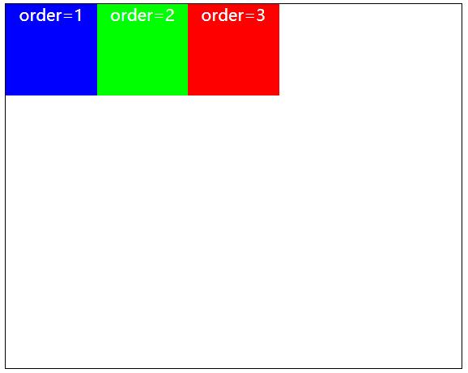
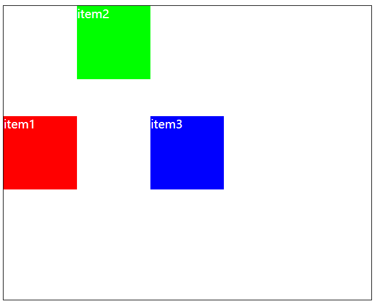
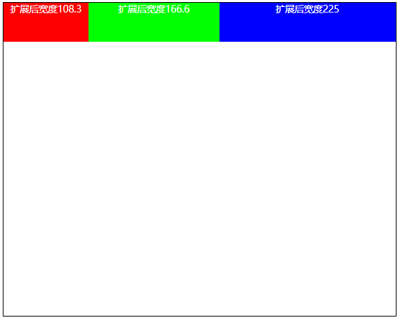
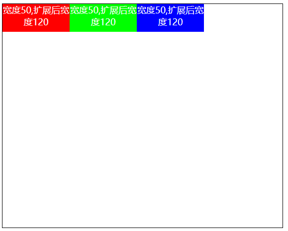
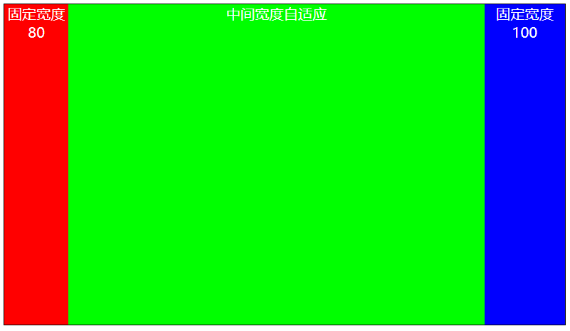
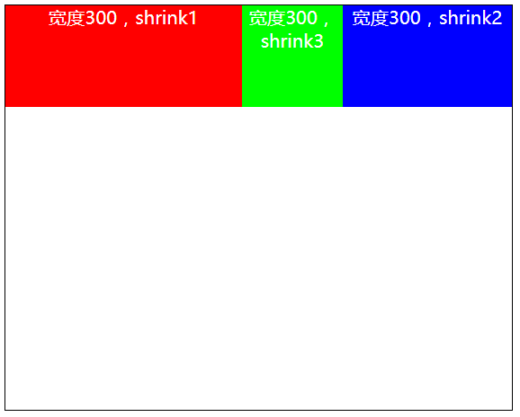
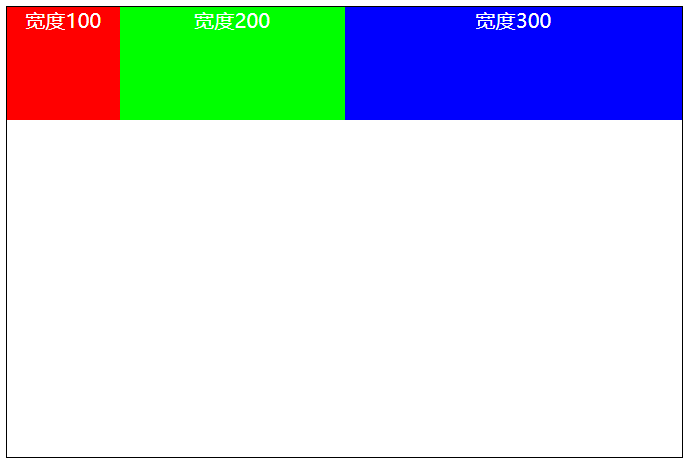
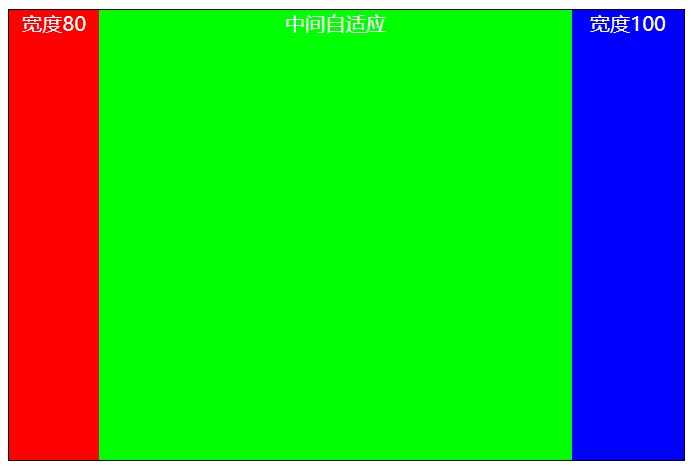

# flex布局(四) : 设置item上的属性

### 1.order 决定item的排布顺序
设置整数，数值越小排在越前面
默认值为0

``` html
<style>
.item1{
    order: 3;
}
.item2{
    order: 2;
}
.item3{
    order: 1;
}
</style>

```


### 2.align-self 决定单个item在交叉轴上的对齐方式
覆盖container设置的aligh-items,且效果相同
同样包含stretch、flex-start、center、flex-end、baseline属性
``` html
<style>
.container{
    align-items: center;
}
.item2{
    align-self: flex-start;
}
</style>

```



### 3.flex-grow 决定items如何扩展
- 可以设置正小数、正整数，默认值是0
- 只有当container在主轴上有剩余容量宽度时，flex-grow才会有效
- flex-grow决定的是扩展的宽度，而不是item的最终宽度，因此正常情况下不通过flex-grow来控制item的宽度
- 由于使用flex-grow会导致的item的宽度不可控，一般用在自适应宽度的元素上。比如两栏布局、三栏布局
- 固定宽度的元素，不建议设置flex-grow

1.当flex-grow总和超过1，每个item扩展的size等于 container剩余容量 / items的flex-grow总和 * item自己的flex-grow
- 案例：容器宽度500，item宽度均为50。扩展的size = 350 / (1+2+3) * item自身的flex-grow
```html
<style>
.item1{
    flex-grow: 1;
}
.item2{
    flex-grow: 2;
}
.item3{
    flex-grow: 3;
}
</style>
```



2.当flex-grow总和小于1，每个item扩展的size等于 container剩余容量 * item自己的flex-grow
- 案例：容器宽度500，item宽度均为50。 扩展的size = 350 * item自身的flex-grow

```html
<style>
.item1{
    flex-grow: .2;
}
.item2{
    flex-grow: .2;
}
.item3{
    flex-grow: .2;
}
</style>
```

3.实际应用，三栏布局，两边宽度固定，中间自适应
``` html

<style>
.container{
    width: 700px;
    height: 400px;
    border: 1px solid #000;

    /* flex布局的排列方式 */
    display: flex;
    flex-direction: row;
    justify-content: flex-start;
    align-items: stretch;
}
.item{
    
    color: #fff;
    text-align: center;
    font-size: 18px;
}
.item1{
    width: 80px;
    flex-grow: 0;
}
.item2{
    flex-grow: 1;
}
.item3{
    width: 100px;
    flex-grow: 0;
}
</style>

<body>
    <div class="container">
        <div class="item item1" style="background: #f00;">固定宽度80</div>
        <div class="item item2" style="background: #0f0;">中间宽度自适应,撑满容器container</div>
        <div class="item item3" style="background: #00f;">固定宽度100</div>
    </div>
</body>

```



### 4.flex-shrink 决定items如何收缩
- 可以设置正小数、正整数，默认值是1
- 只有当items的总宽度超过container的宽度时，才会有效。且默认收缩至等于container的宽度
- 收缩计算方式和grow相同，但是最终收缩的宽度不能小于item的文本宽度和最小宽度
- 正常开发情况下一般让grow的值等于shrink，使item的宽度自适应扩展和收缩
``` html
<style>
.item1{
    flex-shrink: 1;
}
.item2{
    flex-shrink: 3;
}
.item3{
    flex-shrink: 2;  
}
</style>

```



### 5.flex-basis 设置item在主轴上的大小
- 默认值为auto
- 优先级大小：max-width > flex-basis > widht > 内容本身size
- 会覆盖设置在item上的width属性

``` html
<style>
.item1{
    flex-basis: 100px;
}
.item2{
    flex-basis: 200px;
}
.item3{
    flex-basis: 300px;  
}
</style>
```


### 6.flex 复合简写属性
- flex 是 flex-grom || flex-shrink || flex-basis的简写复合属性，可以指定1个、2个、3个值。
- 但是为了养成良好的代码风格，通常指定三个值
- 第一个值是flex-grow，第二个值是flex-shrink，第三个值是flex-basis
- 固定宽度的item设置 `flex : 0 0 100px`
- 自适应宽度的item设置 `flex : 1 1 auto`

案例：三栏布局，中间自适应
``` html
<style>
.container{
    width: 600px;
    height: 400px;
    border: 1px solid #000;

    /* flex布局的排列方式 */
    display: flex;
    flex-direction: row;
    flex-wrap: nowrap;
    justify-content: flex-start;
    align-items: stretch;
}
.item{
    color: #fff;
    text-align: center;
    font-size: 18px;
}

.item1{
    flex: 0 0 80px;
}
.item2{
    flex: 1 1 auto;
}
.item3{
    flex: 0 0 100px; 
}
</style>

<body>
    <div class="container">
        <div class="item item1" style="background: #f00;">宽度80</div>
        <div class="item item2" style="background: #0f0;">中间自适应</div>
        <div class="item item3" style="background: #00f;">宽度100</div>
    </div>
</body>
```


