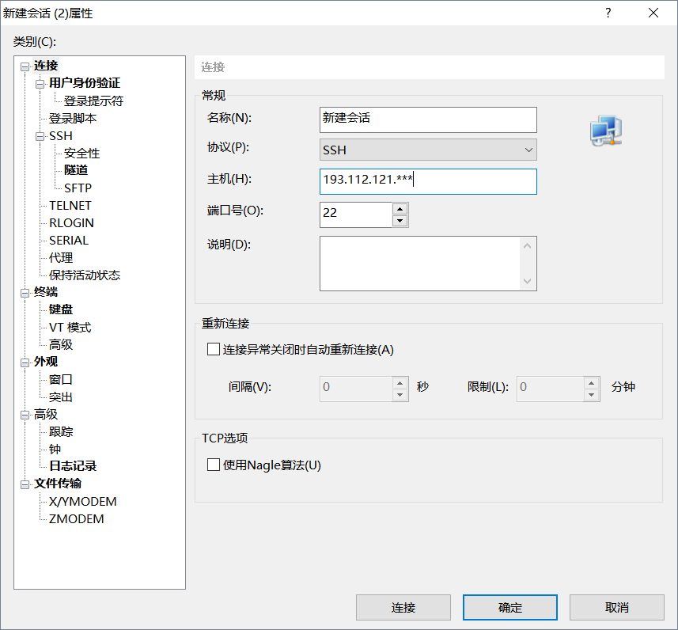
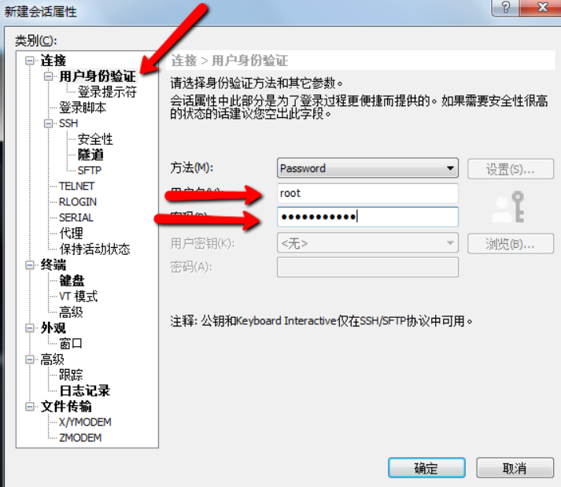
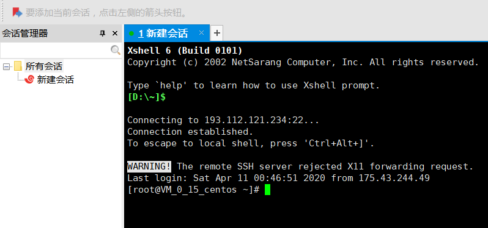
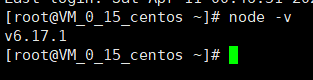
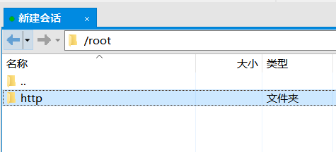
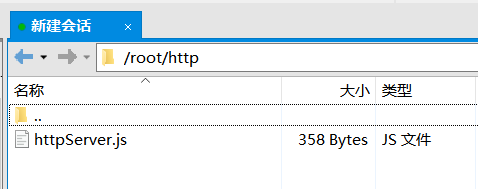
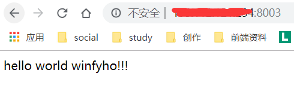

# 腾讯云服务器部署node全过程（Xshell+Xftp+CentOS）

## 1、注册腾讯云账号购买云服务器

[购买学生版腾讯云服务器](https://cloud.tencent.com/act/campus?utm_source=qcloud&utm_medium=head&utm_campaign=campus "链接地址")，选择centos系统

腾讯云服务器购买地址购买成功之后进入实例列表


修改一下主机名称为root,在**更多**里面重置一下登陆服务器的密码（不是你登陆腾讯云页面的密码）
图中你的主机ip是很重要的，等会儿会有大用场，

## 2、下载Xshell和xFtp
**Xshell**是一个可以在腾讯云服务器终端和本地电脑建立命令连接软件
**Xftp**用来和腾讯云服务器进行文件传输。
首先下载Xshell和xFtp，百度或者Google都可以，傻瓜式安装即可。
下面开始打开Xshell,新建一个会话，名称可以自定义，主机ip为你的腾讯云的公网ip（这里是公网）


然后进行用户身份验证，用户名默认是root，密码是你刚才修改的密码



连接成功时，会话会变成绿色



在你的Xshell上点击下面鼠标指向的这个小宝贝，你就和发现打开了刚才安装的xFtp,里面可以进行你本地电脑与远程服务器的文件传输了


## 3、进行node等相关软件安装
在Xshell
输入

`yum install epel-release`
不断y，y按下去，然后

`yum install npm nodejs`
不断y，y按下去，然后

`node -v`



就可以出现你的node版本，表示已经成功将node安装到你的服务器了
（以后都可以进行yum安装像mogodb,express,redis之类的都可以通过yum install +安装名称来安装，这是比wget再tar或者安装nvm之类我见过最快最方便的了，直接yy就行，也是踩了不少坑，不过你肯定需要了解linux的文件存放位置的规则，不了解也暂时没关系，这里影响不大，只做简单的node搭建）

## 4、进行目录创建及http文件规定
在root页面创建一个http文件
`mkdir http`
打开**Xftp**就可以在root下看到一个http文件夹了，



然后在本地电脑（可以用本地的编辑器，sublime之类）新建一个nodejs的文件取名叫**httpserver.js**。

``` js
 const http = require('http');
 const hostname = '10.154.208.000';//服务器上的内网ip
 const port = 8003;//端口
 const server = http.createServer((req, res) => {
 res.statusCode = 200;
 res.setHeader('Content-Type', 'text/html');
 res.end('hello world winfyho');
 });
 server.listen(port,hostname,() => {
 console.log('success in',hostname,port);
});

```
这里需要注意的坑是，hostname为你的服务器的内网ip（不是公网ip）请注意！然后将你的文件拖到Xftp里root的http文件夹下（当然还可以在编辑器中设置路径参数自动上传到服务器中，不过太复杂，篇幅不够还是你自己动手去设置吧）




在Xshell中,进入到http文件夹
`cd http`
然后输入命令
`ll`
可以看到你保存的http服务器文件名（我保存的是httpserver.js）
然后在Xshell中运行nodejs文件
`node httpserver.js`

## 5、访问你的服务器
最后在浏览器地址栏输入 你的公网ip+端口（这回是公网了哦！），你会看到服务器响应了你一个hello world !


